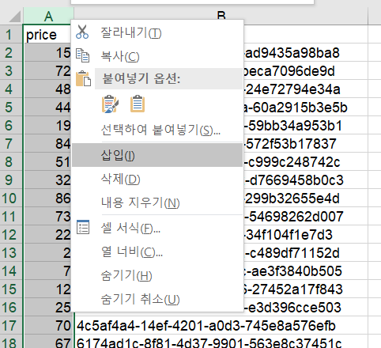

# [메인 마크다운.md](README.md)

# Ch05. Redis 활용 서비스 개발
<details>
<summary>펼치기/접기</summary>

## 01. REST API와 MVC 패턴 장/단점
<details>
<summary>펼치기/접기</summary>

### [MVC 패턴]  

                                          
사용자 → `**Browser**` → `**View**` → `**Controller**` → `**Model**`(Service, Repository)   
　　　　　　　　　　　　　　　　　　　　　　　　　　　　↓  
　　　　　　　　　　　　　　　　　　　　　　　　　　　`**Data**`  
　　　　　　　　　　　　　　　　　　　　　　　　  　　(SQL, NoSQL)


- **장점** : 분리, 확장 편의성  
  - `분리`: 각 역할을 명확히 분리함으로써, 사용자 인터페이스(View), 비즈니스 로직(Model), 요청 처리(Controller) 등을 독립적으로 개발하고 유지보수할 수 있다．
  - `확장성`: 각 컴포넌트를 독립적으로 수정하고 확장할 수 있어, 시스템을 쉽게 확장할 수 있다.  
             새로운 기능을 추가하거나 변경할 때 기존 구조에 미치는 영향을 최소화할 수 있다.
- **단점** : View ↔ Model간 의존성 발생, 시간 지날수록 복잡성 증가
  - `View ↔ Model 간 의존성 발생`: View가 Model의 데이터를 기반으로 동작하기 때문에 View와 Model 간의 간접적인 의존성이 생깁니다. 이로 인해 시스템이 커지면 의존 관계가 복잡해질 수 있다.
  - `시간이 지날수록 복잡성 증가`: 시스템 규모가 커지면 MVC 패턴을 유지하는 데 복잡도가 증가할 수 있다.  
       여러 Controller와 View가 얽히게 되면 관리가 어려워질 수 있다.
    - 특히, 대형 애플리케이션에서는 View와 Controller 간의 관계가 복잡해져서 코드가 비대해지고, 관리와 유지보수가 어려워질 수 있다.

</details>

## 02. Redis Library 종류
<details>
<summary>펼치기/접기</summary>

### Lettuce vs Jedis

[비교 링크](https://redis.com/blog/jedis-vs-lettuce-an-exploration/)

- #### **Jedis** : 낮은 개발 복잡도.
  - 사용이 간단하며 낮은 개발 복잡도를 제공한다.
  - 동기 방식의 데이터 처리에 적합하며, 비교적 간단한 Redis 활용에 적합하다.
- #### **Lettuce** : 다양한 옵션 존재(advanced), Scaling, non-blocing reactive application에 유리
  - 다양한 옵션과 고급 기능(advanced)을 제공한다.
  - Scaling에 유리하다.
    - 여러 Redis 서버를 조합하여 데이터를 분산처리 하거나, Redis Cluster와 같은 환경에서 데이터 처리 성능을 확장하는 데 적합하다.
    - 대량의 데이터를 처리하거나 다중 사용자 요청을 처리할 때, 수평 확장을 통해 성능을 향상시킬 수 있다.
  - 비동기 반응형 애플리케이션 지원 (non-blocking reactive application)
    - 네트워크 요청이나 Redis 작업을 수행하는 동안 스레드가 대기하지 않고 다른 작업을 수행할 수 있도록 설계되어 있다.
    - WebFlux, Reactor, RxJava와 같은 반응형 프로그래밍 도구와 잘 연동된다.
    - 이를 통해 고성능 이벤트 기반 애플리케이션 개발이 가능하며, 대규모 트래픽 환경에서도 효율적으로 리소스를 활용할 수 있다.
</details>

## 03. 가격정보데이터와 Redis Data Type
<details>
<summary>펼치기/접기</summary>

### 자료구조 종류
- #### **String**: 1:1관계
  - key-value 형태로 하나의 key에 하나의 value를 매핑한다.
  - 단순한 key-value 매핑 구조라서, Java의 Map과 유사하다.
- #### **List**: 순서존재, Queue와 Stack으로 사용
  - 순서가 있어서 데이터를 삽입한 순서대로 처리된다.
  - LPUSH, RPUSH 명령어를 통해 **Queue(FIFO)**와 Stack(LIFO) 구조로 사용 가능하다.
- #### **Sets**: 순서와 관계없이 저장, 중복 불가
  - 리스트처럼 여러 개의 값을 저장할 수 있지만, 순서는 중요하지 않다.
  - Set은 중복을 허용하지 않으며, 하나의 key에 여러 개의 Set 요소가 들어갈 수 있다.
- #### **`Sorted Sets`**: ZSET, Scode 개념 존재. Set과 같은데 정렬이 필요한 곳에 사용
  - Set과 비슷하지만, 각 요소에 Double 타입의 Score를 부여해서 정렬할 수 있다.
  - Score에 따라 자동으로 정렬되며, 순위 기반으로 데이터를 처리할 때 유용하다.
  - Double 타입(score)에 맞춰서 값의 크기에 따라 편리하게 조회할 수 있다.
    - 예를 들어, 가격이 100개가 있을 때, 가장 낮은 가격을 찾으려면 가장 작은 Score 값을 찾으면 된다.
    - RDB 환경에서 가격을 기준으로 ORDER BY를 사용하여 가장 저렴한 가격을 찾는 것과 유사하다.  
      그러나 Sorted Sets는 이미 정렬된 상태에서 값을 가져올 수 있어, 미리 정렬된 값을 빠르게 조회할 수 있는 장점이 있다.
- #### **Hashes**: Field:Value형태 여러 커플 존재. RDB의 TABLE 개념으로 많이 사용
  - 1:다 관계를 저장할 수 있다.
  - RDB의 테이블과 비슷한 구조로, 하나의 key에 여러 개의 field와 value를 매핑한다.
    - 예시: Key(테이블): A, Field(컬럼): 기억, Value: 1
  - RDB에 데이터를 저장하기 전 혹은 캐시 형태로 활용할 때 유용하다.

### Soroted Set(ZSET) 기본 명령어
- **ZADD**: 입력
  - 데이터를 추가한다.
- **ZCARD**: Count
  - 지정된 키에 몇개의 멤버가 들어있는지 카운팅한다.
- **ZRANGE**: 정렬순서로 조회
  - 예를들어 10개씩 조회한다면 1~10까지 조회하며, 인덱스는 0부터 시작한다. (0~9)
  - 만약 20개 항목이 필요하면 0~19까지 조회할 수 있다.
- **ZRANGEBYSCORE**: Score로 조회
  - 가격정보로 예를들면 1만원 ~ 2만원 사이 제품 중 가장 저렴한 것을 조회할 수 있다.
- **ZREM**: 삭제
  - 예를 들어, 더 이상 판매하지 않는 상품을 삭제할 때 사용한다.
- **ZSCORE**: 특정 멤버의 Scroe를 조회
  - 예를 들어, 제품의 가격을 조회할 때 사용된다.
- **ZRANK**: 특정 멤버의 Rank를 조회
  - 예를들어, 제품을 잘 구매한것인지 확인하고 싶은 유저가 있다면,  
    전체 상품 리스트에서 최저가 순으로 조회 해 봤을 때 몇 번째로 저렴한 제품을 구매했는지 확인할 수 있다.
</details>

## 04. 가격정보데이터와 Redis 실습 
<details>
<summary>펼치기/접기</summary>

### Redis 기동 (한줄씩 실행)
(기동을 위한 Redis 설치 및 설정은 [Ch04. Redis 설치 및 Configuration.md](Ch04.%20Redis%20%EC%84%A4%EC%B9%98%20%EB%B0%8F%20Configuration.md)에서 확인합니다.) 

  ```bash
  & "C:/Program Files/Redis/redis-server.exe" "C:/Program Files/Redis/conf/redis.master.conf"
  & "C:/Program Files/Redis/redis-server.exe" "C:/Program Files/Redis/conf/redis.slave.conf"
  & "C:/Program Files/Redis/redis-server.exe" "C:/Program Files/Redis/conf/sentinel26379.conf" --sentinel
  & "C:/Program Files/Redis/redis-server.exe" "C:/Program Files/Redis/conf/sentinel26380.conf" --sentinel
  & "C:/Program Files/Redis/redis-server.exe" "C:/Program Files/Redis/conf/sentinel26381.conf" --sentinel
  & "C:/Program Files/Redis/redis-cli.exe"
  ```

### 명령어 실습

#### 명령어 정리
 - **ZADD** (score, member 정보 추가)
   ```bash
   ZADD key score member
   ```
 - **ZCARD** (수량 확인)
   ```bash
   ZCARD key
   ```
 - **ZRANGE** (순위 범위 조건)
   ```bash
   ZRANGE key 순위범위시작인덱스 순위범위끝인덱스
   ```
   **ZRANGE** (순위 범위 조건) - score와 함께 조회: **withscores**
   ```bash
   ZRANGE key 순위시작인덱스 순위끝인덱스 withscores 
   ```
 - **ZREM**
   ```bash
   ZREM key member
   ```
 - **ZRANGEBYSCORE** (score 범위 조건)
   ```bash
   ZRANGEBYSCORE key score범위시작값 score범위끝값
   ```
 - **ZRANGEBYSCORE** (score 범위 조건) - score와 함께 조회: **withscores**
   ```bash
   ZRANGEBYSCORE key score범위시작값 score범위끝값 withscores
   ```

- **ZSCORE** member기준 score 조회
  ```bash
  ZSCORE key member
  ```
- 특정 member의 score 랭킹 조회 (해당 member가 존재하지 않는다면 nil 로 출력)
  ```bash
  ZRANK key member
  ```

   
#### 테스트 시나리오

- 정렬된 제품의 가격조회.
- 상품 삭제.
- 내가 산 제품의 어느정도 가격대인지 랭킹 조회.
- 특정 가격대의 상품 조회.

#### 테스트 실습

- `1번 상품 추가`  
  가격이 12000원인 상품번호 p0001 상품을 rediszsettest KEY로 추가 
  ```bash
  > ZADD rediszsettest 12000 p0001
  ```

- `상품 수량 확인`  
  ZADD를 통해 추가한 rediszsettest가 저장되었는지 수량을 통해 확인한다.
  ```bash
  > ZCARD rediszsettest
  ```

- `2번 ~ 5번 상품 4개 추가`  
  가격이 13,000원인 상품번호 p0002 상품을 rediszsettest KEY로 추가
  ```bash
  > ZADD rediszsettest 13000 p0002
  ```
  가격이 13,500원인 상품번호 p0003 상품을 rediszsettest KEY로 추가
  ```bash
  > ZADD rediszsettest 13500 p0003
  ```
  가격이 8,500원인 상품번호 p0004 상품을 rediszsettest KEY로 추가
  ```bash
  > ZADD rediszsettest 8500 p0004
  ```
  가격이 100,000원인 상품번호 p0005 상품을 rediszsettest KEY로 추가
  ```bash
  > ZADD rediszsettest 100000 p0005
  ```
- 0 ~ 2까지의 순위를 조회한다.
  ```bash
  > ZRANGE rediszsettest 0 2
  ```
  결과
  ```text
  1) "p0004"
  2) "p0001"
  3) "p0002"
  ```
- 0 ~ 2까지의 순위를 score(가격)과 함께 조회한다.
  ```bash
  > ZRANGE rediszsettest 0 2 withscores
  ```
  결과
  ```text
  1) "p0004"
  2) "8500"
  3) "p0001"
  4) "12000"
  5) "p0002"
  6) "13000"
  ```
- 8500원 상품 판매 중단 (해당 상품 삭제)
  ```bash
  > ZREM rediszsettest p0004
  ```
- score 포함한 0 ~ 2 까지 순위 재조회
  ```bash
  > ZRANGE rediszsettest 0 2 withscores
  ```
  결과
  ```text
  1) "p0001"
  2) "12000"
  3) "p0002"
  4) "13000"
  5) "p0003"
  6) "13500"
  ```
  1위였던 8,500원짜리 p0004 상품이 제거되었고 2위였던 p0001부터 그 아래 순위 상품 모두 1씩 순위가 상승했으며 마지막 3번째 순위에 p0003 상품이 추가되었다

- 5만원 ~ 11만원 사이 제품 조회(가격 범위 조건)  
  사용자가 너무 저렴한 가격은 가품이라고 생각할 수 있다는 가정하에 상품 가격을 기준으로 조회한다.
  ```bash
  > ZRANGEBYSCORE rediszsettest 50000 110000 withscores
  ```

- p0003 상품의 가격이 얼마인지 상품기준 가격 조회
  ```bash
  > ZSCORE rediszsettest p0003
  ```
  결과
  ```text
  "13500"
  ```
- p0002 상품의 가격 랭킹 조회
  p0002 상품을 13000원 주고 샀는데 잘 산것인지 해당 상품의 랭킹 조회한다.
  ```bash
  > ZRANK rediszsettest p0002
  ```
  결과
  ```text
  (integer) 1
  ```

</details>

## 05. Redis Sample Data 생성과 입력 (Key, Value Design)
<details>
<summary>펼치기/접기 </summary>

### mockaroo


1. Field Name과 Type 그리고 Options를 위 사진과 같이 입력  
2. #Rows: 1000입력, Format: CSV를 선택
   window일 경우 Excel을 선택한다.
3. 최 하단 `[GENERATE DATA]` 버튼을 클릭

### Excel
1. 생성된 액셀 파일에 가장 좌측 셀에 셀을 새로 추가 삽입하여 prodGrpId 컬럼명을 입력한다.  
     
2. prodGrpId 컬럼 하위로 1부터 50까지 FPG0001 ~ FPG0050을 입력한다.  
      
     
   
3. prodGrpId를 1~50까지 복사하여 51~100까지 추가한다.
4. prodGrpId를 1~100까지 복사하여 101~200, 201~300, 301~400, 401~500 총 4회 붙여넣기 한다.
5. prodGrpId를 1~500까지 복사하여 501~1000까지 붙여넣기 한다.
6. 1000개의 row가 제대로 추가되었는지 확인 후 다시 가장 좌측 셀에 셀을 새로 추가하여 zadd 명령어를 1000번 row 까지 반복하여 추가한다.
7. 전체 내용을 복사한 뒤 액셀 파일은 따로 저장한다.

#### *1~50까지의 고정값을 1000번까지 20회 반복하는 이유는 프로덕트(제품)의 그룹을 50개로 가정하기 때문이다.*

### 파일 생성
- #### linux  
  ```bash
  vi sample.redis
  ```
  위 명령어를 통해 vi를 열고 이전에 생성한 [redis_sample.xlsx](redis%2Fsample%2Fredis_sample.xlsx)의 내용을 붙여넣기 한다.


- #### windows  
  메모장을 열고 이전에 생성한 [redis_sample.xlsx](redis%2Fsample%2Fredis_sample.xlsx)의 내용을 붙여넣기 한 다음  
  다른 이름으로 저장 을 누르고 파일 형식(T)를 파일 이름(N)을 확장자(.redis)를 포함한 sample.redis로 저장한다.

### 파일 내용을 Redis CLI로 전달

- #### linux
  ```bash
  redis-cli < sample.redis
  ```

- #### window: powershell
  ```bash
  Get-Content "C:/Program Files/Redis/sample.redis" | & "C:/Program Files/Redis/redis-cli.exe"
  ```
  

- #### redis-cli 샘플데이터 조회
  FPG0001과 FPG0050을 ZCARD 명령을 통해 각각 조회해본다.
  - redis-cli.exe 실행
    ```bash
    & "C:/Program Files/Redis/redis-cli.exe"
    ```
  - zcard 조회 명령 진행
    ```bash
    zcard FPG0001
    zcard FPG0050
    ```
  - [조회 결과 이미지]  
  

  20개씩 50개 라고 생각했을 때 1000개의 데이터가 잘 저장되었다.

</details>
</details>
